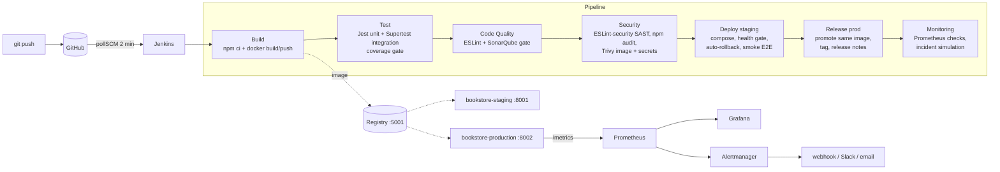

# Online Bookstore – DevOps Pipeline with Jenkins (SIT753 7.3HD)

My SIT774 *Online Bookstore* (Node.js + Express 5 + SQLite via sql.js) delivered by a **7-stage
Jenkins pipeline**: Build → Test → Code Quality → Security → Deploy → Release → Monitoring.
The CI server, SonarQube, image registry, staging, production, Prometheus, Alertmanager and
Grafana all run locally in Docker and are defined as code in this repository.

## Architecture



## The application

| Area | Details |
|---|---|
| Pages (`public/`) | Home, Books, Search, Contact, Query/FAQ, Register, Login, Checkout, Profile, Admin |
| API (`src/routes/`) | `POST /api/register`, `POST /api/login`, `POST /api/logout`, `GET /api/me`, `GET /api/books`, `POST/GET /api/orders`, `POST /api/queries`, admin-only `GET /api/queries`, `GET /api/users` |
| Business rules (`src/services/`) | server-side pricing from the catalogue, 1 loyalty point per $1, validation |
| Data (`src/database.js`) | SQLite with **versioned migrations** (`PRAGMA user_version`), transactions |
| Ops | `GET /health`, `GET /ready` (DB + schema version), `GET /metrics` (prom-client), `/chaos/*` for incident simulation |

### Bugs found while building the pipeline (fixed, with regression tests)

| Bug (seen in the SIT774 screenshots) | Root cause | Fix |
|---|---|---|
| Checkout shows **$0.00**, 0 loyalty points | `featuredBooks` stored `"$18.99"`; modal showed `"$$18.99"`; `replace('$','')` removed only one `$` → `parseFloat` = `NaN` → cart.js turned it into `0` | prices stored as numbers **and** the server re-prices every order from its own catalogue |
| Profile: **"Error loading orders"** | existing `bookstore.db` was created before the `points` column existed; `CREATE TABLE IF NOT EXISTS` never adds columns → `no such column: points` | versioned migrations run at start-up (migration 2 adds `points`) |
| Order saved but points not added | no transaction: the `UPDATE users SET points` failed after the order insert | order + items + points in one transaction |
| Wrong order id under concurrency | "latest order by `created_at`" (1-second resolution) | `last_insert_rowid()` |
| Navbar search did nothing | broken HTML attributes `class="d-flex w-50 action="search.html…` | fixed quotes |

## Pipeline stages

| # | Stage | Tools | Gate / automation |
|---|---|---|---|
| 1 | **Build** | `npm ci`, Docker multi-stage build, private registry | image tag `VERSION-bBUILD-GITSHA`, OCI labels, pushed = artefact storage |
| 2 | **Test** | Jest, Supertest, jest-junit | 79 tests (unit + integration + security regression), JUnit + coverage published, **fails under 80 % lines / 70 % branches** |
| 3 | **Code Quality** | ESLint (complexity, max-depth, function length), SonarQube | ESLint ≤ 10 warnings; custom *Bookstore Gate* (coverage, duplication ≤ 3 %, maintainability A…) via `waitForQualityGate` |
| 4 | **Security** | ESLint-security + no-unsanitized (SAST), npm audit (SCA), Trivy image + fs | 4 parallel scans with gates, merged `security-summary.md` – see [SECURITY.md](SECURITY.md) |
| 5 | **Deploy** | Docker Compose (`deploy/docker-compose.app.yml`) | staging, health-gated, **automatic rollback**, E2E smoke tests (register → order → history) |
| 6 | **Release** | registry promotion, git tag | same image promoted (no rebuild), `vX.Y.Z-bN` + `production` tags, prod secrets/config, optional approval, release notes |
| 7 | **Monitoring** | Prometheus, Alertmanager, Grafana | verifies scraping + 7 alert rules, live KPIs, UNSTABLE on critical alerts, `SIMULATE_INCIDENT` proves alert → notification |

## Quick start

Prerequisites: Docker Desktop (≥ 6 GB RAM), Git.

```bash
git clone https://github.com/<you>/online-bookstore.git && cd online-bookstore
cp .env.example .env                      # set passwords + 2 session secrets (>= 32 chars)
docker compose -f docker-compose.infra.yml up -d --build

# SonarQube: http://localhost:9000 (admin/admin -> change password), then:
SONAR_ADMIN_PASSWORD=<new-password> ./scripts/sonar_setup.sh
#   My Account -> Security -> Global Analysis token -> put in .env as SONAR_TOKEN
docker compose -f docker-compose.infra.yml up -d jenkins

# Jenkins: http://localhost:8080 -> New Item -> Pipeline -> "Pipeline script from SCM"
#   Git URL = this repo, branch */main, Script Path = Jenkinsfile -> Build Now
```

| Service | URL |
|---|---|
| Jenkins | http://localhost:8080 |
| SonarQube | http://localhost:9000 |
| Bookstore – staging | http://localhost:8001 |
| Bookstore – production | http://localhost:8002 |
| Prometheus alerts | http://localhost:9090/alerts |
| Alertmanager | http://localhost:9093 |
| Grafana | http://localhost:3000/d/bookstore-overview |
| Alert notifications | `docker logs -f alert-receiver` |

Admin page: register with the e-mail in `ADMIN_EMAILS` (`admin@bookstore.local` by default, see `deploy/env/*.env`).

### Local development

```bash
npm ci
npm test                 # all tests + coverage
npm run lint
PORT=3100 npm start      # port 3000 is used by Grafana
```

Build parameters: `REQUIRE_APPROVAL` (manual gate before prod), `SIMULATE_INCIDENT` (inject 5xx errors
and prove alerting), `PUSH_GIT_TAG` (push release tag, needs a `github-token` credential).

## Design decisions

* **Build once, deploy many** – the image tested in staging is the one released; environments differ only
  by `deploy/env/*.env` and Jenkins credentials.
* **Fail fast, cheapest first** – tests (seconds) before SonarQube and scans (minutes); scans run in parallel.
* **Never trust the client** – prices, totals and admin rights are decided on the server.
* **Schema as code** – migrations are versioned and run on start-up, so every environment converges.
* **Health-gated deploys** – a container that never becomes `healthy` is rolled back automatically.
