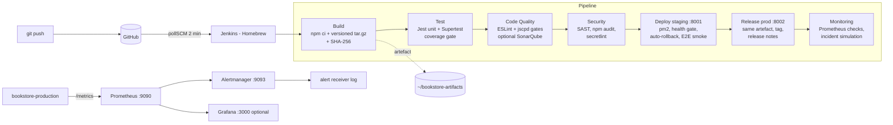

# Online Bookstore – DevOps Pipeline with Jenkins (SIT753 7.3HD)

My SIT774 *Online Bookstore* (Node.js + Express 5 + SQLite via sql.js) delivered by a **7-stage
Jenkins pipeline**: Build → Test → Code Quality → Security → Deploy → Release → Monitoring.
Everything runs on a Mac with Homebrew – Jenkins, staging and production (managed by pm2),
Prometheus, Alertmanager and Grafana – and is defined as code in this repository.

## Architecture (default: Jenkins on macOS, no Docker)



`Jenkinsfile.docker` + `docker-compose.infra.yml` contain an alternative, fully containerised
variant (Jenkins, SonarQube, registry and the app all in Docker) – not needed for the default setup.

## The application

| Area | Details |
|---|---|
| Pages (`public/`) | Home, Books, Search, Contact, Query/FAQ, Register, Login, Checkout, Profile, Admin |
| API (`src/routes/`) | `POST /api/register`, `POST /api/login`, `POST /api/logout`, `GET /api/me`, `GET /api/books`, `POST/GET /api/orders`, `POST /api/queries`, admin-only `GET /api/queries`, `GET /api/users` |
| Business rules (`src/services/`) | server-side pricing from the catalogue, 1 loyalty point per $1, validation |
| Data (`src/database.js`) | SQLite with **versioned migrations** (`PRAGMA user_version`), transactions |
| Ops | `GET /health`, `GET /ready` (DB + schema version), `GET /metrics` (prom-client), `/chaos/*` for incident simulation |

### Bugs found while building the pipeline (fixed, with regression tests)

| Bug (seen in the SIT774 screenshots) | Root cause | Fix |
|---|---|---|
| Checkout shows **$0.00**, 0 loyalty points | `featuredBooks` stored `"$18.99"`; modal showed `"$$18.99"`; `replace('$','')` removed only one `$` → `parseFloat` = `NaN` → cart.js turned it into `0` | prices stored as numbers **and** the server re-prices every order from its own catalogue |
| Profile: **"Error loading orders"** | existing `bookstore.db` was created before the `points` column existed; `CREATE TABLE IF NOT EXISTS` never adds columns → `no such column: points` | versioned migrations run at start-up (migration 2 adds `points`) |
| Order saved but points not added | no transaction: the `UPDATE users SET points` failed after the order insert | order + items + points in one transaction |
| Wrong order id under concurrency | "latest order by `created_at`" (1-second resolution) | `last_insert_rowid()` |
| Navbar search did nothing | broken HTML attributes `class="d-flex w-50 action="search.html…` | fixed quotes |

## Pipeline stages

| # | Stage | Tools | Gate / automation |
|---|---|---|---|
| 1 | **Build** | `npm ci`, `scripts/package.sh` | versioned artefact `online-bookstore-<ver>-b<build>-<sha>.tar.gz` + SHA-256, archived in Jenkins and in `~/bookstore-artifacts` |
| 2 | **Test** | Jest, Supertest, jest-junit | 79 tests (unit + integration + security regression); fails under 80 % lines / 70 % branches |
| 3 | **Code Quality** | ESLint, jscpd, (SonarQube optional) | 0 errors & ≤ 10 warnings (complexity ≤ 10, depth ≤ 3, fn ≤ 60 lines); duplication ≤ 3 %; trend graphs in Jenkins |
| 4 | **Security** | ESLint-security + no-unsanitized (SAST), npm audit (SCA), secretlint | 3 parallel gates + merged `security-summary.md` – see [SECURITY.md](SECURITY.md) |
| 5 | **Deploy** | `scripts/deploy-local.sh` + pm2 | staging on :8001, health-gated, **automatic rollback** to previous release, E2E smoke tests |
| 6 | **Release** | same script, git tag | checksum-verified promotion of the SAME artefact to :8002, prod secrets/config, optional approval, release notes |
| 7 | **Monitoring** | Prometheus, Alertmanager (+ Grafana) | starts the stack if needed, verifies scraping + 7 alert rules, live KPIs, `SIMULATE_INCIDENT` proves alert → notification |

## Setup on macOS (no Docker)

```bash
# 1. Tools (once)
brew install jenkins-lts node prometheus alertmanager      # optional: brew install grafana
npm install -g pm2
brew services start jenkins-lts                             # Jenkins -> http://localhost:8080
cat ~/.jenkins/secrets/initialAdminPassword                 # (path may be ~/.jenkins or $(brew --prefix)/var/jenkins)
```

2. **Jenkins first start**: paste the password → *Install suggested plugins* → create admin user.
   Then *Manage Jenkins → Plugins → Available* and install: **Coverage**, **Warnings**, **HTML Publisher**,
   **Pipeline: Stage View** (and **SonarQube Scanner** only if you use `USE_SONARQUBE`).
3. **Credentials** (*Manage Jenkins → Credentials → System → Global → Add*):

   | ID | Kind | Value |
   |---|---|---|
   | `github-token` | Username with password | GitHub username + personal access token (classic, `repo`) |
   | `staging-session-secret` | Secret text | output of `openssl rand -hex 32` |
   | `prod-session-secret` | Secret text | another `openssl rand -hex 32` |

4. **Job**: *New Item* → `online-bookstore` → **Pipeline** → *Pipeline script from SCM* → Git →
   repo URL + `github-token` → branch `*/main` → Script Path `Jenkinsfile` → **Build Now**.

| What | URL |
|---|---|
| Jenkins | http://localhost:8080 |
| Bookstore – staging | http://localhost:8001 |
| Bookstore – production | http://localhost:8002 |
| Prometheus alerts | http://localhost:9090/alerts |
| Alertmanager | http://localhost:9093 |
| Grafana (optional) | http://localhost:3000/d/bookstore-overview |
| Alert notifications | `tail -f ~/bookstore-monitoring/alerts.log` |
| Running processes | `pm2 ls` / `pm2 logs bookstore-production` |

Admin page: register with `admin@bookstore.local` (see `ADMIN_EMAILS` in `deploy/env/*.env`).

### Useful commands

```bash
npm ci && npm test                    # all tests + coverage
npm run lint
PORT=3100 npm start                   # local dev server
SESSION_SECRET=$(openssl rand -hex 32) scripts/deploy-local.sh production --rollback   # manual rollback
pm2 stop bookstore-production         # simulate an outage -> BookstoreDown alert after ~30 s
scripts/monitoring-local.sh down      # stop Prometheus/Alertmanager/Grafana
```

Build parameters: `REQUIRE_APPROVAL`, `SIMULATE_INCIDENT`, `USE_SONARQUBE`, `PUSH_GIT_TAG`.

## Design decisions

* **Build once, deploy many** – the artefact tested in staging is the one released (SHA-256 verified); environments differ only
  by `deploy/env/*.env` and Jenkins credentials.
* **Fail fast, cheapest first** – tests (seconds) before SonarQube and scans (minutes); scans run in parallel.
* **Never trust the client** – prices, totals and admin rights are decided on the server.
* **Schema as code** – migrations are versioned and run on start-up, so every environment converges.
* **Health-gated deploys** – a release that does not answer `/health` with the expected version is rolled back automatically (pm2 restarts the previous release folder).
